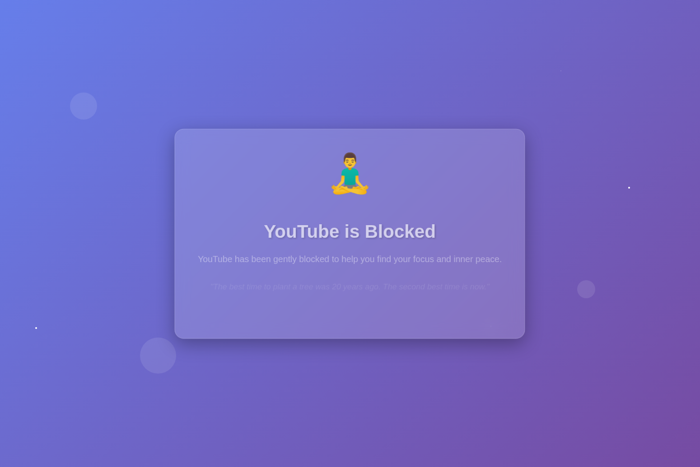

# YouTube Blocker Chrome Extension

A simple Chrome extension that blocks access to YouTube to help you stay focused and productive.

## Features

- Blocks all YouTube domains (youtube.com, www.youtube.com, m.youtube.com)
- Shows a custom blocked page with motivational message
- Toggle blocking on/off via popup interface
- Clean, modern UI design

## Installation

1. Open Chrome and navigate to `chrome://extensions/`
2. Enable "Developer mode" in the top right corner
3. Click "Load unpacked" and select the extension folder
4. The YouTube Blocker extension will be added to your browser

## Usage

- Click the extension icon in the toolbar to open the popup
- Use the toggle button to enable/disable YouTube blocking
- When enabled, attempting to visit YouTube will redirect to a blocked page
- The extension remembers your preference across browser sessions

## Files

- `manifest.json` - Extension configuration
- `rules.json` - Declarative net request rules for blocking
- `popup.html` - Extension popup interface
- `popup.js` - Popup functionality
- `background.js` - Background script for managing blocking state
- `blocked.html` - Page shown when YouTube is blocked

## Permissions

- `declarativeNetRequest` - Required for blocking web requests
- `storage` - Required for saving user preferences
- `host_permissions` - Required for accessing YouTube domains
